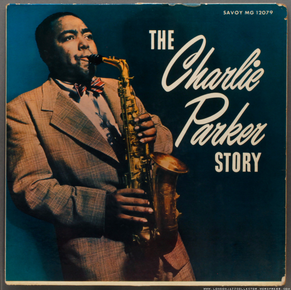

# CHARLIE PARKER’S “KO KO”

## By: Uriel Navarro

Charlie Parker is said to be one of bebop era’s greatest player. He was
an influential and talented musician who contributed so much to jazz. He
was an amazing saxophonist who gained wide recognition for his brilliant
solos and innovative improvisations. _“Ko Ko”_ comes to mind when thinking
about a famous Charlie Parker song. This 1945 bebop song was a perfect
choice to analyze, considering this is a favorite of mine.

“Ko Ko” is not like most songs, in that the beginning gives an elaborate
intro but there does not seem to be an established tune. Once the song
hits 0:06 seconds, Gillespie comes in with a trumpet solo followed by
Parker’s solo at 0:13 seconds. But even then there is no chord
progression, it just seems to be a little abstract. Once you hit 0:20
the introduction seems to come to an end, and at 0:25 seconds Parker
starts his solo. Accompanying him is a drummer who plays primarily on
the ride cymbal and the bass playing a walking bass line. His solo is
mostly a string of fast eighth notes and from time to time there being a
dramatic outburst.

His unique style of play is demonstrated by his accenting. The rhythms
are disorienting not because this tempo goes really quick but because of
accents constantly changing. The swooping upbeats also give you a sense
of his tricky rhythm; the speed that Parker plays at is almost
mind-boggling. When the song hits 1:41, there seems to be many shifts in
his thoughts as many different spills of notes are played. This is
typical for Parker as it is shown throughout much of his solo.

As the song progresses, around 2:07 Max Roach comes up as the next
soloist. Most of his solo consists of drum licks and bass drum drops in
a quick fashion. His solo overall seems to get increasingly more
complicated as he plays each of his notes. Roach finishes his solo at
2:29, with the different soloist coming in and playing all their
improvised pieces to bring the song to an end.

  Charlie Parker Songs   Year of Song   Length   Era
  ---------------------- -------------- -------- -------
  ‘KO KO’                1945           2:30     Bebop
  ‘Salt Peanuts’         1942           3:09     Bebop
  ‘Hot House’            1945           4:23     Bebop

